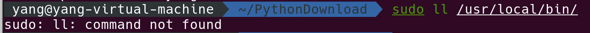

[toc]


一些Linux知识补充

---


# 环境变量配置

> 之前鸟哥的echo配置环境变量只是临时起作用，当shell被关闭or注销电脑就失效了

最好的解决办法：

将文件做一个软连接，并把软连接放在`/usr/local/bin`里面

> `/usr/local/bin` 所有用户都将这个文件加入了环境变量的，因此可以对所有用户都生效

### 实例：

```shell
#做一个软连接,放在/usr/local/bin下面
yang-virtual-machine# ln -s /home/yang/PythonDownload/geckodriver /usr/local/bin/geckodriver

#查看是否配置成功
 ~/PythonDownload  ll /usr/local/bin
total 0
lrwxrwxrwx 1 root root 37 4月  18 11:13 geckodriver -> /home/yang/PythonDownload/geckodriver
```

- 如果连接成功颜色如下：

   

**attention：**

- geckodriver不能换名字

# su 与 sudo区别

**sudo:**

无需切换root用，使当前用户暂时(默认15min)具有root用户的权限，执行命令时需要输入密码，密码是当前用户的密码。

**su:**切换到root用户，输入的密码是root用户的密码


**实例**

下面例子中，ll是普通用户设置的别名，root用户没有，因此可以证明此时sudo是让普通用户暂时以root用户的身份在执行



```shell

```

