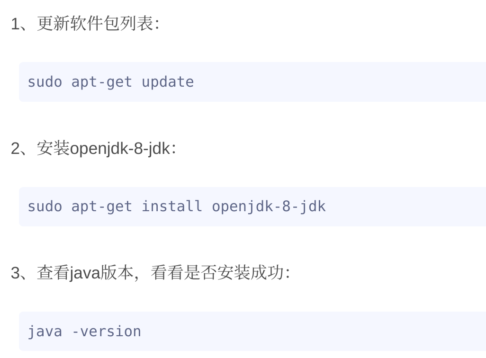

[toc]

# 通用安装

- 更新源

  `sudo apt-get update`

- 安装

  `sudo apt-get install app'sname`
  
- 卸载安装

  `\# 删除软件及其配置文件 apt-get --purge remove <package>`

# jdk安装

https://blog.csdn.net/zbj18314469395/article/details/86064849#commentBox




# (ubuntu)安装python


## 安装

```
apt install python3
```


## 更换快捷方式

`/usr/bin下面通常是各种软连接的存储`

> 原来的python3指向python3.8

1. 查看python3.8的执行文件位置

```shell
root@yang-virtual-machine:/usr/bin# whereis python3
python3: /usr/bin/python3 /usr/bin/python3.8 /usr/lib/python3 /usr/lib/python3.8 /usr/lib/python3.9 /etc/python3 /etc/python3.8 /usr/local/lib/python3.8 /usr/include/python3.8 /usr/share/python3 /usr/share/man/man1/python3.1.gz
```

2. 通过原来的快捷方式找到指向文件的位置

```shell
root@yang-virtual-machine:/usr/bin# ll /usr/bin/python3
lrwxrwxrwx 1 root root 9 3月  29 17:30 /usr/bin/python3 -> python3.8*
```


3. 创建新的软连接

```
root@yang-virtual-machine:/usr/bin# ln -sv python3.8* /usr/bin/python
'/usr/bin/python' -> 'python3.8'
```


## 安装pip3

```
sudo apt install python3-pip
```


# (centos)安装Python

https://www.pythonf.cn/read/167077

## 检查Python2的安装环境

- 查看python2安装的位置：/usr/bin

- 下载对应安装包：（在主机中下载好后复制到VM中解压）

   如何获得安装包的下载地址：右击连接另存为

   

   

   

```shell
╭─root@MiWiFi-R1CL-srv /home/gg  
╰─➤  whereis python
python: /usr/bin/python /usr/bin/python2.7 /usr/lib/python2.7 /usr/lib64/python2.7 /etc/python /usr/include/python2.7 /usr/share/man/man1/python.1.gz

╭─root@MiWiFi-R1CL-srv /home/gg  
╰─➤  curl -O https://www.python.org/ftp/python/3.7.10/Python-3.7.10.tgz
```

## 安装Python 3

> 下面3.6.8全部改成自己对应的版本

```shell
# 解压
[root@localhost ~]#  tar xzvf Python-3.6.8.tgz
# 使用yum安装必要的工具
[root@localhost ~]#   yum install yum-utils
# 构建python依赖环境
[root@localhost ~]#  yum-builddep python
# 进入文件夹
[root@localhost ~]# cd Python3.6.8
# 运行配置，默认安装位置为/usr/local/bin/,改变使用–prefix=/alternative/path，建议使用默认配置
[root@localhost ~]# ./configure
# 编译  
[root@localhost ~]#  make
# 安装
[root@localhost ~]#  make install
```

查看python版本和安装位置

```shell
[root@localhost ~]# python3 --version
Python 3.6.8
[root@localhost ~]# whereis python
python: /usr/bin/python /usr/bin/python2.7 /usr/lib/python2.7 /usr/lib64/python2.7 
/etc/python /usr/local/bin/python3.6m /usr/local/bin/python3.6 /usr/local/bin/python3.6m-config 
/usr/local/bin/python3.6-config /usr/local/lib/python3.6 /usr/include/python2.7 /usr/share/man/man1/python.1.gz
```

更换默认python

现在安装的python3在使用时候需要输入python3.

我们现在需要将python输入则使用python3. 

原理的symbolic link是 ：python->python2->python2.7

现在删除原来的symbolic link重新建立

```shell
# 进入 /usr/bin 目录
[root@localhost ~]# cd /usr/bin
# 删除指向python2 的软连接
[root@localhost ~]# rm python
# 重新建立python3和pip3的软连接，此实例安装位置为/usr/local/bin/,如安装位置不同，请切换
╭─root@MiWiFi-R1CL-srv /usr/bin  
╰─➤  ln -sv /usr/local/bin/python3 /usr/bin/python
‘/usr/bin/python’ -> ‘/usr/local/bin/python3’
╭─root@MiWiFi-R1CL-srv /usr/bin  
╰─➤  ln -sv /usr/local/bin/pip3 /usr/bin/pip
‘/usr/bin/pip’ -> ‘/usr/local/bin/pip3’

```


```shell
╭─root@MiWiFi-R1CL-srv /usr/bin  
╰─➤  ln -sv /usr/local/bin/python3 /usr/bin/python
‘/usr/bin/python’ -> ‘/usr/local/bin/python3’
```

## 善后：yum

yum是使用的python2.7，并且在原来yum相关的配置文件中写的是python(当时代表的是2.7)，现在经过我们修改python指代的是3.7，因此要去yum的相关文件中将python改为python2.7，否则那个python以后会找上现在的3.7

```shell
[root@localhost ~]#  vim   /usr/bin/yum
# 把文件头部的解释器   #!/usr/bin/python   改成    #!/usr/bin/python2.7
[root@localhost ~]#  vim /usr/libexec/urlgrabber-ext-down
# 把文件头部的解释器   #!/usr/bin/python   改成    #!/usr/bin/python2.7
[root@localhost ~]#  vim /usr/bin/yum-config-manager
# 把文件头部的解释器   #!/usr/bin/python   改成    #!/usr/bin/python2.7
```


# 搜狗拼音

https://cloud.tencent.com/developer/article/1711900

attention：


最后唤醒搜狗拼音的快捷键下面界面设置：

在右上角出现一个键盘标志，点击进入，选择Configure Current Input Method，进入Global Config查看快捷键（此处我改成了与windows相同的ctrl + shift）


https://linuxize.com/post/how-to-install-visual-studio-code-on-centos-7/

>安装了之后vscode的界面直接freeze：
>
>解决办法：更换系统到Ubuntu

## 在CentOS上安装Visual Studio Code

执行以下步骤在CentOS系统上安装Visual Studio Code：

1. 首先导入Microsoft GPG密钥：

   ```
   sudo rpm --import https://packages.microsoft.com/keys/microsoft.asc复制
   ```

2. 接下来，创建以下回购文件以启用Visual Studio Code存储库：

   ```
   sudo nano /etc/yum.repos.d/vscode.repo
   ```

   将以下内容粘贴到文件中：

   /etc/yum.repos.d/vscode.repo

   ```ini
   [code]
   name=Visual Studio Code
   baseurl=https://packages.microsoft.com/yumrepos/vscode
   enabled=1
   gpgcheck=1
   gpgkey=https://packages.microsoft.com/keys/microsoft.asc
   ```

   > 复制保存：
   >
   > step1:ctrl+x
   >
   > step2:yes

3. 启用存储库后，通过键入以下命令安装最新版本的Visual Studio Code：

   ```
   sudo yum install code
   ```

Visual Studio Code已安装在CentOS桌面上，您可以开始使用它了。

输入下面指令使用

```
code --user-data-dir
```

## 关闭代码提示

zhihu.com/question/52771892

 "editor.quickSuggestions": false

加入到json文件中


