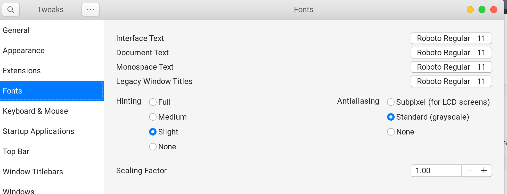

修改shell：

主题：

https://www.opendesktop.org/s/Gnome/p/1013741/

参考文献：https://my.oschina.net/u/186291/blog/4649273

# 各种主题：

## 主题：

**主题**： https://www.pling.com/p/1275087

文件解压到/usr/share/themes

**icons**：https://www.gnome-look.org/p/1305429/

文件解压到/usr/share/icons

## 字体：

Google的Roboto字体

1. 搜索到字体并下载zip文件，解压到/usr/share/fonts

2. 在Tweaks中设置如下：

   

# 问题：

**shell无法修改：**

在gnome中安装user - themes

在tweaks-extension开启user-themes：

选择shell的主题：

效果如下：

