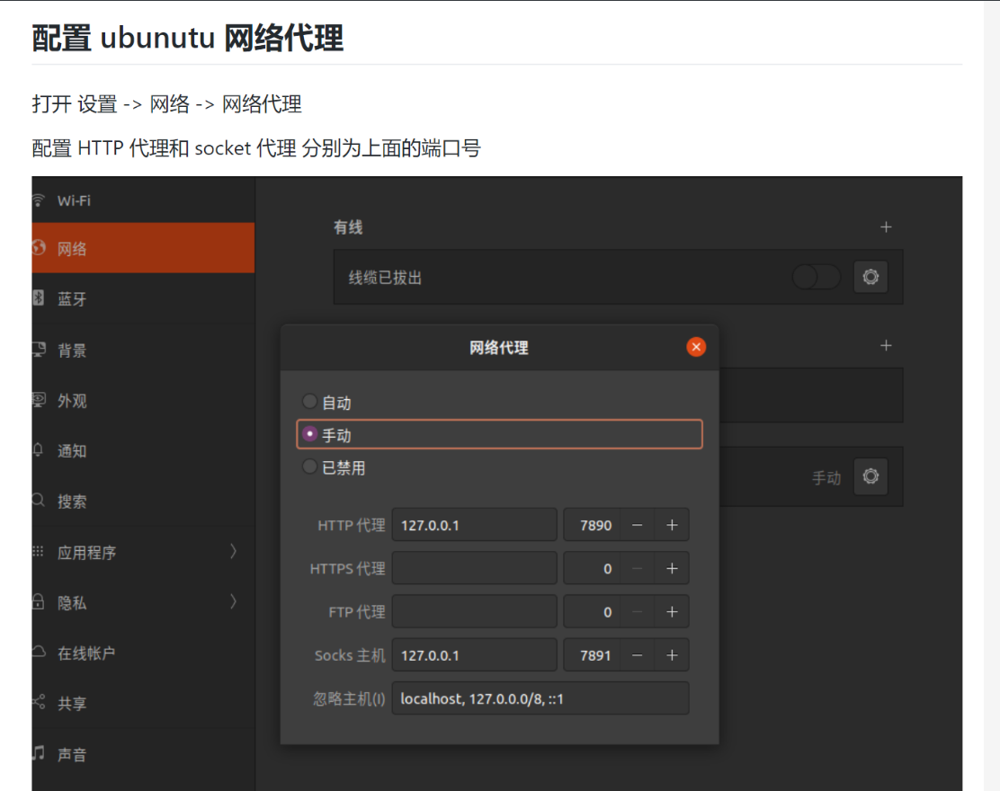
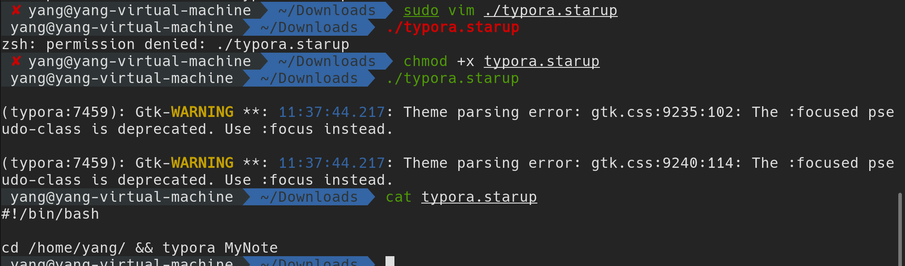
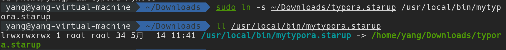
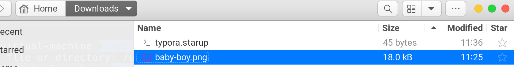
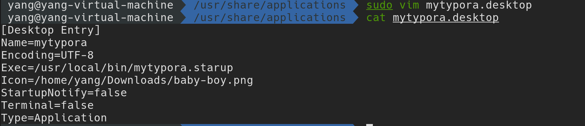

[toc]


# 初次使用增加root用户

- Ubuntu 允许第一个普通用户添加root用户

```
sudo passwd root
```


# shell一键换源

https://blog.csdn.net/u013246692/article/details/112760051

一键命令

````
bash <(curl -sL https://gitee.com/SuperManito/LinuxMirrors/raw/main/ChangeMirror.sh)
````

- 选择使用阿里的源
- 附：如果提示Command 'curl' not found则说明当前未安装curl软件包，安装命令如下

`apt install -y curl`


# Ubuntu相关配置

## 配置clash

- 配置clash


**1 下载一个clash**

search ： clash for Linux

找到https://github.com/Dreamacro/clash/releases下载包


（最好在github上下载了移动到Linux中）

**1.4解压文件**

```
gzip -d clash*
```


**1.3下载配置文件**

将配置文件复制到Ubuntu

- 下面的port是监听的端口，自己可以修改


##### 

**2 切换到clash文件所在的目录：**

#### 运行clash

**3运行clash ，并保持在后台一直运行**

```shell
 yang@yang-virtual-machine  ~/Desktop  nohup ./clash-linux-amd64-v1.4.2 -f config.yaml -d . >> test.nohup 2>&1 0>&1 &
[1] 2597
```

- nohub：将命令在后台运行（但是输出是在前台）
- `&`: 将输出也放在后面
- 2>&1 0>&1：将错误输出重定向到标准输出，将正确输出也重定向到stdout


**4 查看监听的端口确定clash是否运行成功**，

下面展示7890端口被监听说明成功运行

```
 ⚙ yang@yang-virtual-machine  ~/Desktop  netstat -tnpl
(Not all processes could be identified, non-owned process info
 will not be shown, you would have to be root to see it all.)
Active Internet connections (only servers)
Proto Recv-Q Send-Q Local Address           Foreign Address         State       PID/Program name    
tcp        0      0 127.0.0.1:9090          0.0.0.0:*               LISTEN      2597/./clash-linux- 
tcp        0      0 127.0.0.1:7890          0.0.0.0:*               LISTEN      2597/./clash-linux- 
tcp        0      0 127.0.0.1:7891          0.0.0.0:*               LISTEN      2597/./clash-linux- 
tcp        0      0 127.0.0.53:53           0.0.0.0:*               LISTEN      -                   
tcp        0      0 127.0.0.1:631           0.0.0.0:*               LISTEN      -                   
tcp6       0      0 ::1:631                 :::*                    LISTEN      -  
```

**5 如果没有成功进入设置进行配置**

http://www.ptbird.cn/ubuntu-2004-clash-for-linux.html



## 安装proxychains

> 安装了clash仅提供了窗口，但需要让所有流量从那个端口经过需要使用Proxychains
>
> 
>
> ProxyChains是Linux和其他Unices下的代理工具。 它可以使任何程序通过代理上网， 允许TCP和DNS通过代理隧道， 支持HTTP、 SOCKS4和SOCKS5类型的代理服务器， 并且可配置多个代理。

安装

```
 proxychains apt install code
```

使用：在下载有的国外文件时，使其通过代理

​		在命令前加上proxychains

```
 sudo proxychains apt install code
```


# 桌面快捷方式

1. shell脚本：打开文件命令

   - 写脚本

   - 增加执行权限

   - 测试是否可执行

     

2. 制作软连接到使全部用户可用

   

3. 准备桌面图标

   

4. .desktop桌面文件脚本

   - 要用sudo

   

5. 查看是否成功

   


