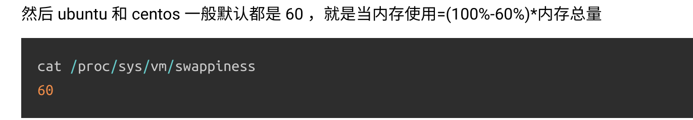

# 解压出错：

通常指向下载压缩文件不全，如果是把文件拖进VM会常常出现这种问题，

- 可以选择virtualshare的方式与虚拟机共享文件
- ll -h 显示两个文件大小是否前后一致
- md5码校验两个文件(没试过)

```
[root@centos7-xinsz08 ~]# tar xf prometheus-2.7.2.linux-amd64.tar.gz 

gzip: stdin: unexpected end of file
tar: 归档文件中异常的 EOF
tar: 归档文件中异常的 EOF
tar: Error is not recoverable: exiting now

```


gzip: stdin: unexpected end of file tar: Unexpected EOF in archive

# 搜狗无法输入中文

现象：

         可以切换输入法，但是搜狗输入法下输入汉字，没有显示汉字，只有拼音

解决办法：

​		- 通过下面的命令重启输入法

```
killall fcitx
killall sogou-qinpanel #这一步我尝试的时候找不到命令，未来的阿宝鱼你也可以不用写
fcitx
```

# Swap分区被占用

> mem还剩很多的情况下，swap分区被占用

https://www.huaweicloud.com/articles/c5a70f89e4f98ad1c26b7ae48aeb1f06.html

swappiness=0的时候表示最大限度使用物理内存，然后才是 swap空间，swappiness＝100的时候表示积极的使用swap分区，并且把内存上的数据及时的搬运到swap空间里面。



修改swappiness为10

```shell
sysctl vm.swappiness=10 #临时修改
echo "vm.swappiness=10" >> /etc/sysctl.conf #永久修改
sysctl -p #生效
```


