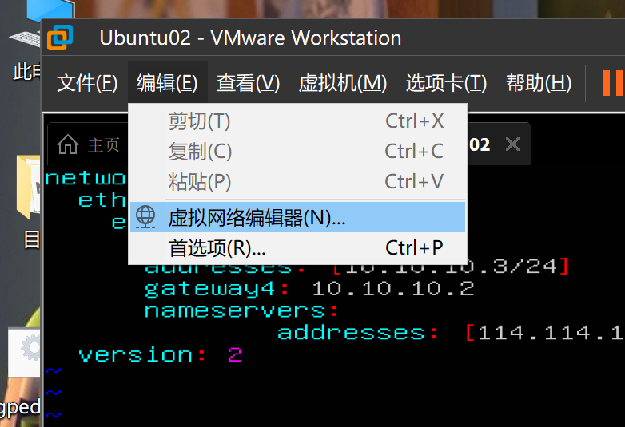
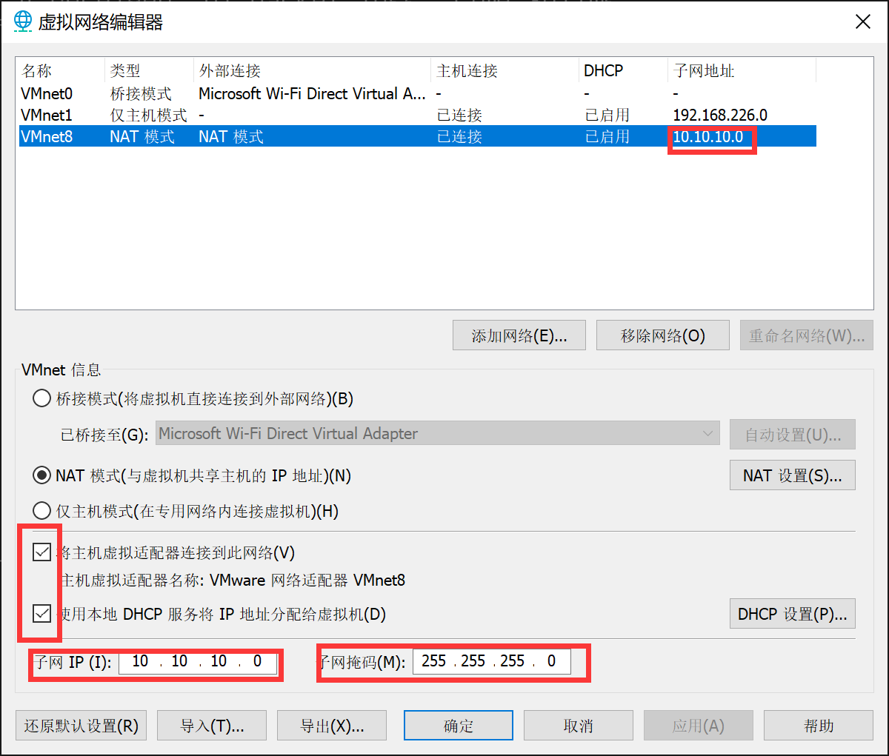
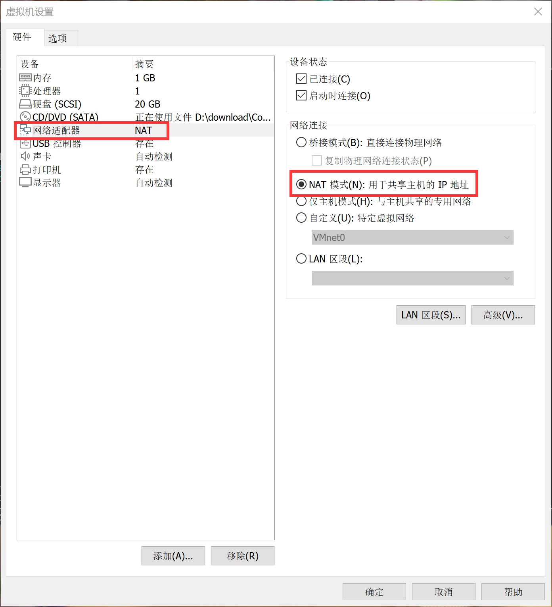
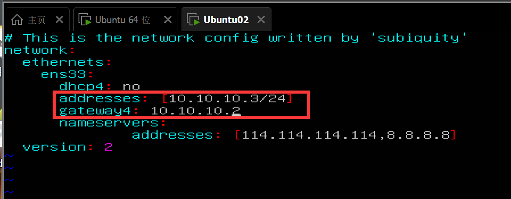

# 多台虚拟机通信

# 一、三种通信模式的区别

## 1. NAT模式

- 对外连接网网络时，外面看到的只有一个IP地址。

- 但是在子网内部，所有虚拟机的IP地址是在主机IP网段内的，此时主机相当于是路由器

因此在用NAT模式通信时：

主机、各个虚拟机都需要在同一个网段，并且各台虚拟机的网关就是主机。

# 二、Net模式设置虚拟机通信

## 1. 设置虚拟网卡

VMware为我们提供了三张虚拟网卡，现在要使用NAT这张网卡

1. 在VMnet8设置Net模式；

2. 设置子网：10.10.10.0

3. 设置DHCP

## 1. 在虚拟机中配置

Server服务器的虚拟机使用静态IP地址，其他虚拟机可以使用DHCP动态IP地址。

1. 设置虚拟机的网络连接模式 为 NAT模式

    （每台虚拟机都设置为该模式）

    

2. 配置虚拟机IP地址： 设置为子网里面的一个IP， 且子网掩码在这里写，因为VMware不会自己寻找对应网段

`10.10.10.3/24` 

3. 配置网关：Net所在子网的第一个IP地址

 `10.10.10.2`

3. 配置生效： 

    

4. 测试

    ping 10.10.10.2   : 物理主机

    ping 114.114.114.114 : 上网

    ping 10.10.10.128 : 其他虚拟机（DHCP分配的动态IP地址）

# 参考文章

[多台虚拟机](https://developer.aliyun.com/article/196763)